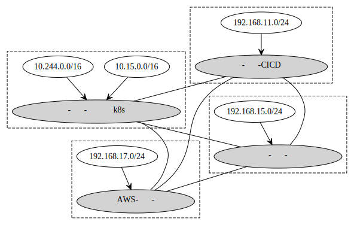
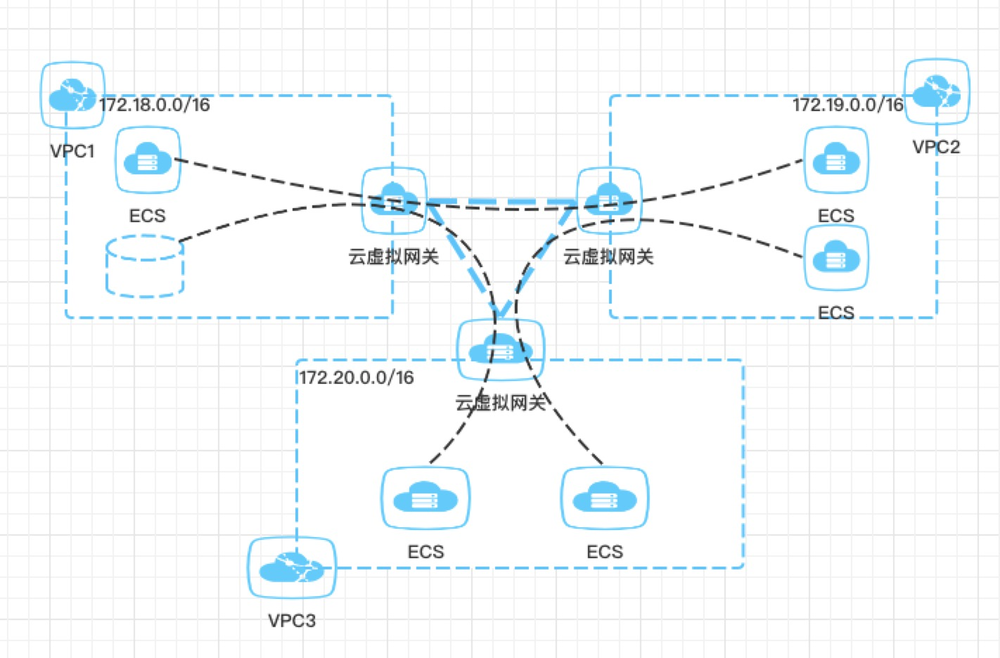
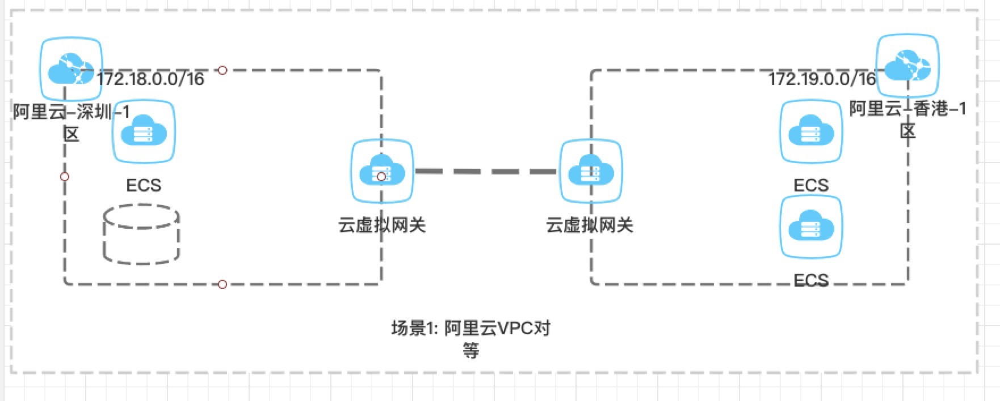
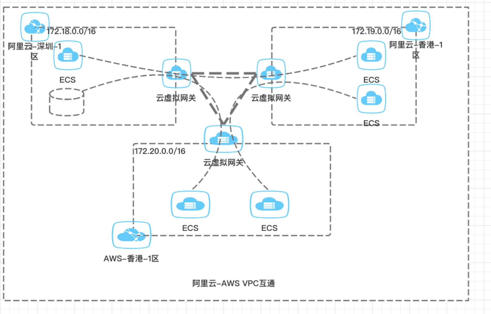
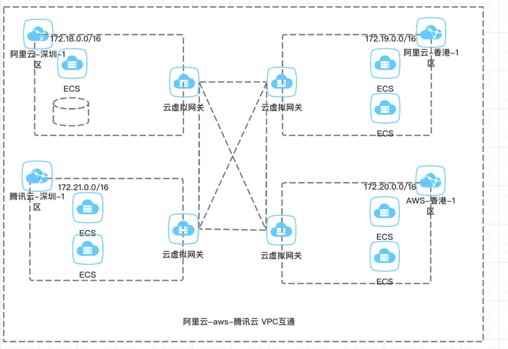
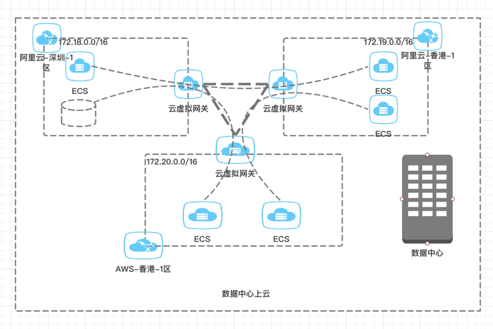

 

# cframe是什么
cframe是一款L3 overlay 隧道软件，可以解决以下问题：

- 跨机房、跨云k8s集群互通
- 多云VPC网络互通
- 公有云与idc网络互通

## 应用场景1: 阿里云不同可用区VPC互通

用户公有云使用阿里云，针对大陆用户使用了深圳地区的阿里云，为了应对海外市场，决定开通在香港开通阿里云服务海外用户，但是部分数据（比如中台配置，用户信息等）需要在深圳阿里云同步过去。
由于部分内部服务不便暴露在公网。希望深圳阿里云能够通过内网地址访问香港阿里云，香港阿里云也能够通过内网地址访问深圳阿里云，因此需要将香港阿里云和深圳阿里云的网络进行打通。

## 应用场景2: 阿里云和aws网络打通
AWS一直是云服务厂商的巨头，很多新的产品和解决方案都是由AWS率先提供，现用户需要在海外新增一个香港AWS的VPC，以使用AWS的最新产品，但是部分数据还是需要访问香港阿里与和大陆阿里云，因此需要将三者网络进行打通。

## 应用场景3: 阿里云，aws，腾讯云网络两两互通
阿里云虽然是国内领先的云服务厂商，但是谁也不敢保证哪天出事两或者价格方面做了调整，或者说公司为了缩减预算切换到其他云服务厂商，所以有时也需要考虑使用腾讯云等作为备份，
在必要的时候切换到腾讯云上，因此需要在场景1和场景2的基础之上新加入腾讯云，因此需要解决阿里云，腾讯云，aws这三者网络的互联互通。

## 应用场景4: 数据中心与公有云互通

用户使用自己的数据中心，但是希望使用公有云的部分软件(比如负载均衡)，那么需要公有云能够访问数据中心，数据中心能够访问公有云，单纯使用公网ip通信可能会产生安全问题，因此需要在数据中心与公有云之间构建私有隧道，两者通过私有地址进行访问。

如果您有以上四个应用场景，可以尝试使用cframe进行解决，在使用过程当中有任何问题可以随时提交issue，如果有任何关于cframe的使用问题，或者定制化方案，可以关注我的公众号给我留言。

