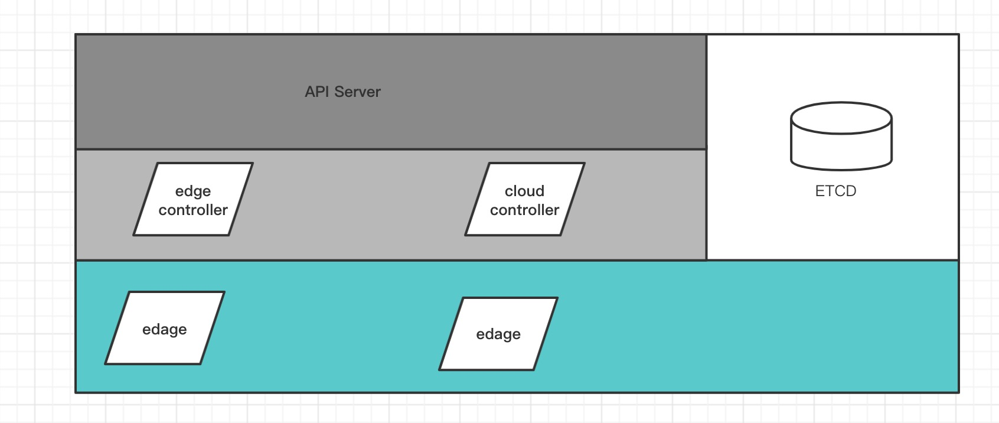

  

  
  

  
  

[English](README_EN.md) | 简体中文

**状态: Alpha**

## 介绍
cframe是一款网格VPN(mesh vpn)项目，能解决多个IP地址不冲突的网络互联，以下是一些典型的应用场景：

- 跨VPC，跨云之间网络互联
- VPC与IDC网络互联
- k8s多集群互联

cframe包括两个重要组件，`controller`和`edge`，controller也即是控制平面，用于路由下发以及edge节点管理，edge也即是转发平面，用于路由和转发数据到对应的edge节点，任意两个edge节点互联，形成一个网状结构。

您可以将edge类比为路由器，每个路由器上保存着全量的路由信息，当一个数据包到来时，edge节点查找全局路由，找到对应的下一跳edge并转发。

## 目录
- [介绍](#介绍)
- [cframe的技术原理](#cframe的核心技术原理)
- [有问题怎么办](#有问题怎么办)
- [关于作者](#关于作者)

## cframe的核心技术原理

如上图所示，cframe包括`controller`和`edge`两个重要角色，除此之外还附加网络管理工具`cfctl`模块，用于管理`edge`以及路由。

`controller`是控制平面，是整个系统最核心的部分，负责管理管理`edge`以及路由，`controller`通过读取和订阅存储与etcd当中的信息，并通过长连接实时下发到edge当中。

`edge`是转发层面，每个edge即是所在的可用区的网关，`edge`节点之间两两互联，形成一个网状的网络拓扑结构，edge实时接收来自controller的消息，然后将其变更应用到本地。

每个edge所在的可用区包括一个或者多个网络，通常如果只需要VPC互通，那么一个网络就可以解决，如果需要VPC内的k8s集群互通，那么就需要使用路由，将该edge所在的可用区的k8s的网段下发到其他edge当中，让其他edge感知到其存在，从而能够正确的路由。

关于更多的设计文档以及使用细节，您可以阅读：

- [cframe简要设计](doc/design.md)
- [使用cframe打通阿里云和aws](doc/usage.md)

[返回目录](#目录)

## 有问题怎么办

- [wiki](https://github.com/ICKelin/cframe/wiki)
- [提交issue](https://github.com/ICKelin/cframe/issues)
- [查看源码](https://github.com/ICKelin/cframe)
- [联系作者交流解决](#关于作者)

[返回目录](#目录)

## 关于作者
一个爱好编程的人，网名叫ICKelin。对于以下任何问题，包括

- 项目实现细节
- 项目使用问题
- 项目建议，代码问题
- 案例分享
- 技术交流

可加微信: zyj995139094
微信群:
