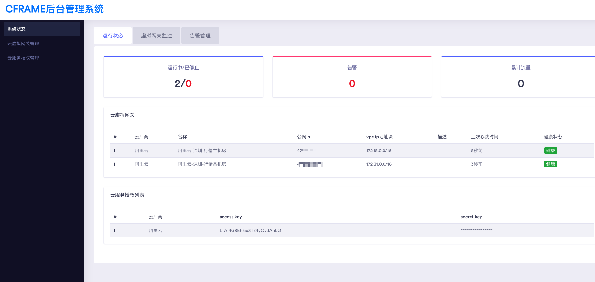
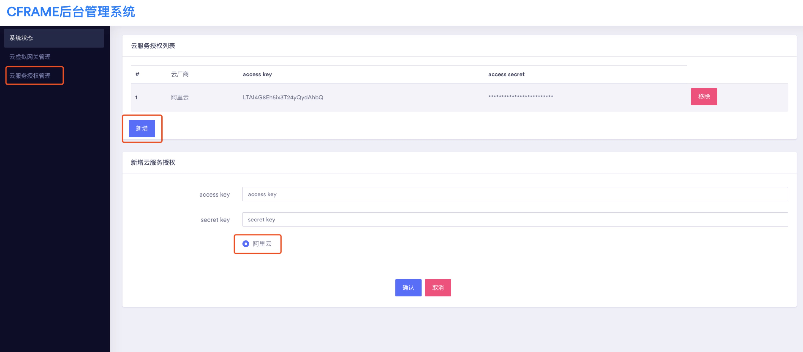
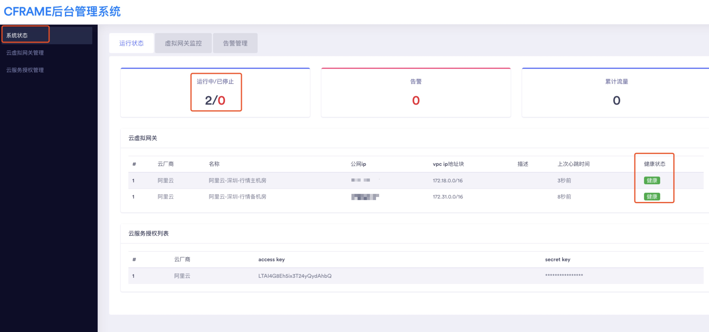

[](https://travis-ci.org/ICKelin/cframe) 

# cframe是什么，解决什么问题
cframe是一款基于公网传输的网络连接技术，通过cframe可以实现企业数据中心与VPC，VPC与VPC之间互联互通


# 功能
- 公有云多个VPC网络互联互通

打通多VPC网络，实现跨VPC互通

-  自建idc上云

打通企业数据中心与公有云，实现多点网络互联互通。

# 优势
1. 配置简单

不需要网络工程师的干预，只需要在后台管理系统登记VPC信息以及云虚拟网关部署的公网ip信息，然后运行即可。

2. 免费开源

cframe是一款开源软件，您可以使用cframe自己搭建自己的一套系统，也可以使用cframe提供了后台管理系统，由于流量不经过cframe的任何服务器，我们提供的后台管理系统也只是负责对数据进行简单的管理，所以这项服务也是免费的。

> cframe提供的后台管理系统运行的apiserver和控制器均为测试环境，会有服务的重启等操作，但是cframe的边缘网关都有自动重连功能。

# 在线测试
在线demo: [cframe后台管理](http://demo.notr.tech/public)


cframe提供一个在线的[后台管理系统](http://demo.notr.tech/public) **（PS：由于作者本人做前端或者做上层应用比较少，相对而言比较粗糙，走过路过的大佬看到了可以随手帮忙进行优化一下）**。

通过这个cframe后台管理系统可以进行在线测试，以下为详细步骤：

## 第一步： 注册&登录
进入到cframe后台管理系统的[注册页面](http://demo.notr.tech/public/signup.html)，注册成功之后会自动跳转到登录页面，输入用户信息登录即可。

## 第二步：新增云授权信息
如果您希望由cframe帮忙自动管理vpc路由，那么您可以配置云授权信息，**如果您比较擅长网络配置或者担心我们执行了一些非法操作，那么您也可以不添加，自己在阿里云的控制台添加VPC路由，可以跳到下一步**.

该步骤相对比较繁琐，但是只是一次性操作，后续没有特殊情况不需要变更。

**创建阿里云子账户**

进入阿里云控制台RAM访问控制模块，用户，创建用户，登录名称和显示名称均填写cframe，并勾选编程访问。 


创建子账号完成之后，需要将accessKey和secretKey保存，后续需要将其登记到云授权管理当中。

**添加权限策略**

在ram访问控制当中，选择权限策略管理，创建权限策略，勾选脚本配置，将以下相关权限粘贴进文本编辑器当中。
```

{
    "Version": "1",
    "Statement": [
        {
            "Action": [
                "ecs:DescribeRegions",
                "ecs:DescribeInstances",
                "vpc:DescribeVpcs",
                "DescribeVRouters",
                "vpc:DescribeRouteTables",
                "vpc:DeleteRouteEntry",
                "vpc:CreateRouteEntry"
            ],
            "Resource": "*",
            "Effect": "Allow"
        }
    ]
}
```

**添加授权**


选择授权，新增授权，用cframe进行模糊搜索 

通过上述配置，完成cframe子账号的创建并授予相关权限，后续无需管理员再进行任何vpc路由相关的操作。

最后，将accessKey和secretKey登记到后台管理页面当中.


## 第三步：新增云虚拟网关
在cframe后台管理系统当中，点击左侧云虚拟网关管理，新增，输入名称，公网ip，对外端口(udp，默认58423，建议输入默认值，可免去后续环境变量配置)，VPC网段等信息，确认提交


> 注意：
> 云虚拟网关是运行在VPC当中某台服务器的软件，需要具备公网IP，安全组放开对外udp端口。

## 第四步：运行cframe边缘网关程序。
边缘网关采用docker的方式运行，您可以运行以下命令执行：

```
docker run --privileged --restart=always --net host -e secret=$您的私有key -v /opt/logs/edge:/log -d ickelin/cframe_edge

```
其中secret环境变量为您的私有key，用于标识您的身份。

> 注意：
> 如果您填写的默认端口不为58423，那么需要指定 -e lis=:$您的端口号。
> 该服务器上应该安装安装tun设备驱动，支持iptables，route等命令。

运行成功之后，您将可以在cframe后台管理界面上看到您的节点状态。



### 最后
我认为这是个很有意思，也很有意义的工程，奈何本人个人精力有限，希望能有更多的人参与进来，无论你是:

- 网络工程师
- 系统运维
- 后端开发人员
- 前端开发人员
- 甚至是销售人员
