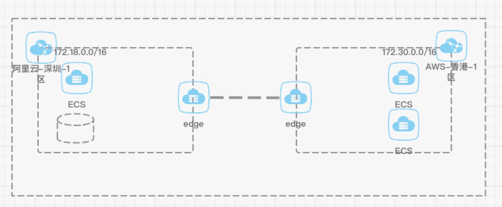

  

  
  

  
  

[English](README_EN.md) | 简体中文

**状态: Work in progress**

## 介绍
cframe是一款网格VPN(mesh vpn)项目，能解决多个IP地址不冲突的网络互联，以下是一些典型的应用场景：

- 跨VPC之间网络互联
- 跨云网络互联
- VPC与IDC网络互联
- k8s多集群互联

cframe包括两个重要组件，`controller`和`edge`，controller也即是控制平面，用于路由下发以及edge节点管理，edge也即是数据平面，用于路由和转发数据到对应的edge节点，任意两个edge节点互联，形成一个网状结构，详细技术细节可以参考[cframe的技术原理](#cframe的技术原理)

## 目录
- [介绍](#介绍)
- [cframe的技术原理](#cframe的技术原理)
- [功能特性](#功能特性)
- [如何开始使用](#如何开始使用)
- [有问题怎么办](#有问题怎么办)
- [关于作者](#关于作者)

## cframe的技术原理

cframe是一款mesh vpn项目，由edge节点两两互联形成edge网络，controller将拓扑信息通过长连接下发到每个edge节点，每个edge节点内部有一个或者多个网络，edge节点会与其他edge节点的连接以及其他edge节点的网络信息，以便路由查询。

edge当中包括以下3种路由：

- edge节点维护的内存路由，用于在收到数据包时，路由到对应的edge节点
- 系统静态路由，用于将数据包发往本机edge应用内部
- 公有云的VPC路由，用于将该VPC当中所有机器发往其他VPC的数据包路由到本VPC当中edge节点所在的机器

接下来会以一个示例结合这三种路由阐述数据包从一个腾讯云VPC网络到另外阿里云VPC的过程，具体拓扑如下。

[返回目录](#目录)

## 功能特性
[返回目录](#目录)

## 如何使用
[返回目录](#目录)

## 有问题怎么办
[返回目录](#目录)

## 关于作者
一个爱好编程的人，网名叫ICKelin。对于以下任何问题，包括

- 项目实现细节
- 项目使用问题
- 项目建议，代码问题
- 案例分享
- 技术交流

可加微信: zyj995139094