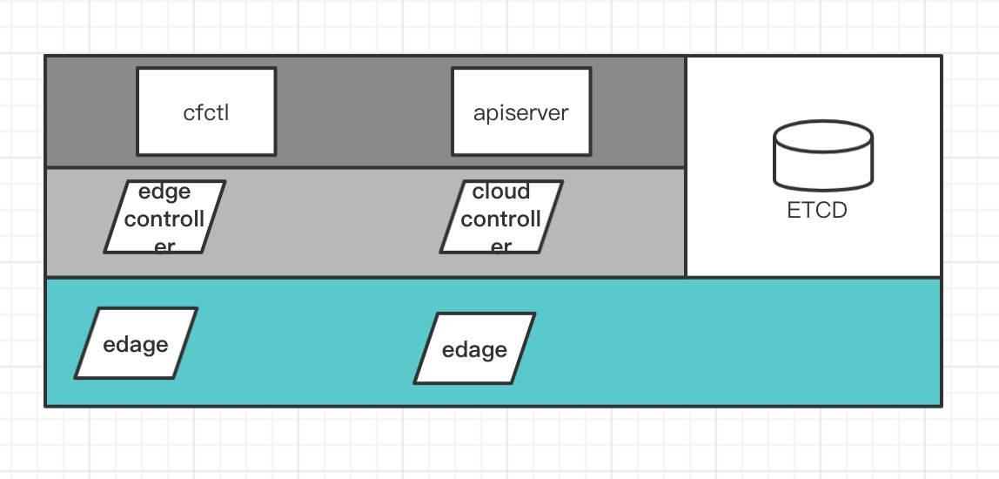
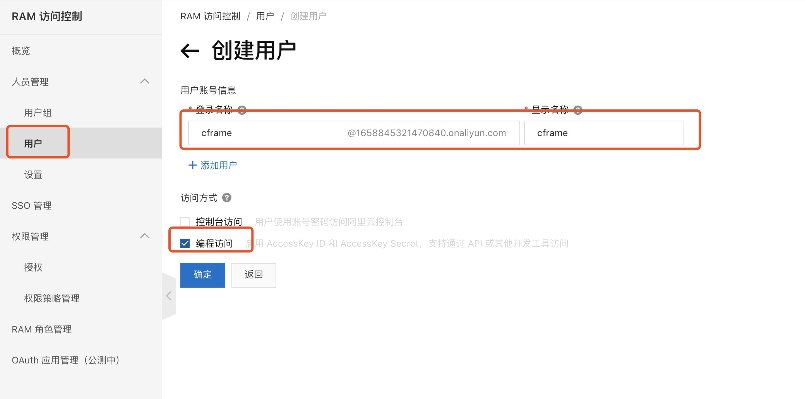
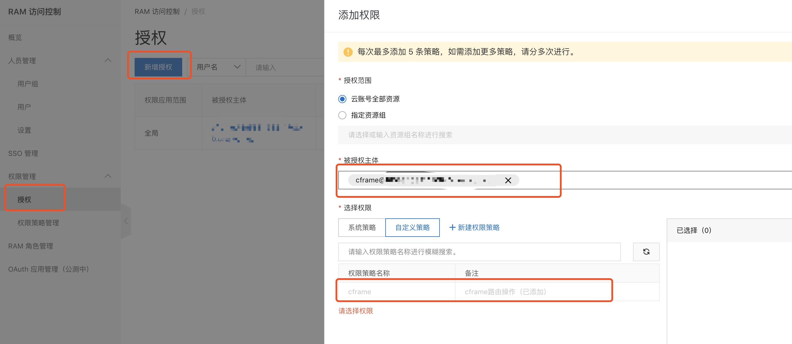

[](https://travis-ci.org/ICKelin/cframe) 

# cframe
cframe是一款云网融合的网络软件，最终目的是

1. 用于连接公有云和公有云，实现多云互联
2. 连接公有云与数据中心，实现公有云与idc互联。

### 整体架构


项目整体而言分为三层。

最上面一层为应用层，面向用户，为用户提供整个系统管理接口，最后将用户配置存储与etcd当中，供下层使用

中间为控制器，用于读取存储在etcd当中的用户配置信息，并与下层建立tcp长连接以及路由的添加/删除操作，从而实现edge节点的动态添加与删除。

最下面一层为边缘节点，也就是真正部署在用户云服务器vpc当中的应用程序，边缘节点会根据配置**自动添加vpc路由**，无需运维与网络工程师干预，因此需要云服务器管理人员开通子账号以及开通部分权限。这个在后续会有说明。

**vpc互联**


### 在线测试
当前已解决阿里云vpc互联，只需要几个步骤即可完成操作。

#### 开通阿里云子账户，并赋予相关权限。

**创建子账户**

进入阿里云控制台RAM访问控制模块，用户，创建用户，登录名称和显示名称均填写cframe，并勾选编程访问。


创建子账号完成之后，需要将accessKey和secretKey保存，后续需要将其配置到edge节点的配置文件当中。

**添加权限策略**

在ram访问控制当中，选择权限策略管理，创建权限策略，勾选脚本配置，将以下相关权限粘贴进文本编辑器当中。
```
{
    "Version": "1",
    "Statement": [
        {
            "Action": [
                "ecs:DescribeRegions",
                "ecs:DescribeInstances",
                "vpc:DescribeVpcs",
                "DescribeVRouters",
                "vpc:DescribeRouteTables",
                "vpc:DeleteRouteEntry",
                "vpc:CreateRouteEntry"
            ],
            "Resource": "*",
            "Effect": "Allow"
        }
    ]
}
```

**添加授权**

选择授权，新增授权，用cframe进行模糊搜索


通过上述配置，完成cframe子账号的创建并授予相关权限，后续无需管理员再进行任何vpc路由相关的操作。

### 使用cfctl添加vpc实例（名称，公网地址:端口，cidr）
cfctl是cframe系统的管理工具，用于操作用户和边缘节点两大模块。

```
➜ ./cfctl 
NAME:
   cfctrl - cfctrl is cframe api server cli.

USAGE:
   cfctl [global options] command [command options] [arguments...]

COMMANDS:
   login    login to cframe, access token will store in token.conf
   edge     edge control(add,del,list,topology)
   help, h  Shows a list of commands or help for one command

GLOBAL OPTIONS:
   --help, -h  show help (default: false)
```

登录cframe，获取到token，cfctl会将token信息保存在token.conf文件当中，在线测试当中，会共用一个用户。

```
➜ ./cfctl login
login reply:  {"code":20000,"message":"success","data":{"Token":"CrYyW9SITg+HcEIiIrsjvQ==","Username":"cframe"}}
save loginReply to token.conf
```

获取当前vpc节点状态
```
➜ ./cfctl edge topology|jq      
{
  "code": 20000,
  "message": "success",
  "data": {
    "edge_node": [
      {
        "name": "hk-1",
        "comment": "",
        "cidr": "172.31.0.0/16",
        "host_addr": "47.242.14.118:58423",
        "status": 0,
        "type": ""
      },
      {
        "name": "sz-1",
        "comment": "",
        "cidr": "172.18.0.0/16",
        "host_addr": "47.115.82.187:58423",
        "status": 0,
        "type": "ali-vpc"
      }
    ],
    "edge_host": []
  }
}
```

新增广州1区vpc

```
➜  ./cfctl edge add --name "gz-1" --hostaddr "47.242.14.188:58423" --cidr "172.20.0.0/16"|jq
{
  "code": 20000,
  "message": "success",
  "data": null
}
➜
```

获取最新新的节点信息，可以发现广州1区的vpc已加入到测试当中

```
➜  cfctl git:(develop) ✗ ./cfctl edge topology|jq                                                                 
{
  "code": 20000,
  "message": "success",
  "data": {
    "edge_node": [
      {
        "name": "gz-1",
        "comment": "",
        "cidr": "172.20.0.0/16",
        "host_addr": "47.242.14.188:58423",
        "status": 0,
        "type": ""
      },
      {
        "name": "hk-1",
        "comment": "",
        "cidr": "172.31.0.0/16",
        "host_addr": "47.242.14.118:58423",
        "status": 0,
        "type": ""
      },
      {
        "name": "sz-1",
        "comment": "",
        "cidr": "172.18.0.0/16",
        "host_addr": "47.115.82.187:58423",
        "status": 0,
        "type": "ali-vpc"
      }
    ],
    "edge_host": []
  }
}
```

由于当前是demo状态，在添加之前建议将其他edge信息删除，以免造成不必要的影响，同时也建议在自己测试完成之后将自己的vpc信息删除，以免影响他人测试。但是系统内置的hk-1vpc不建议删除，该vpc用于验证vpc加入是否成功。

#### 在各个vpc当中部署edge节点
添加完vpc之后，需要在新的vpc当中部署edge程序，config.toml配置如下;

```
controller="demo.notr.tech:58422"
listen_addr=":58423"
name = "gz-1"
type = "ali-vpc"
cframe_secret="y0WBOnDTTZCrj4bo2vau5Q=="

[alivpc]
access_key=$ACCESS_KEY
access_secret=$SECRET_KEY

[log]
level="debug"
days=3
path="log/edge.log"
```

此处cframe key为demo的key，需要将$ACCESS_KEY和SECRET_KEY替换为在第一步当中创建的阿里云子账户的accessKey和secretKey。

配置修改完成后，启动edge程序
```
mkdir log
nohup ./edge -c config.toml &
```

完成上述步骤之后，就可以进行网络连通性测试了，**系统会保留一个hk-1的edge节点供测试使用，建议不要将该edge删除,**`ping 172.31.185.159` 可进行测试。

**注意:**

    需要打开安全组当中公网udp端口58423的访问权限，该端口用于edge之间的通信。

### 最后
我认为这是个很有意思，也很有意义的工程，奈何本人个人精力有限，希望能有更多的人参与进来，无论你是:

- 网络工程师
- 系统运维
- 后端开发人员
- 前端开发人员
- 甚至是销售人员
