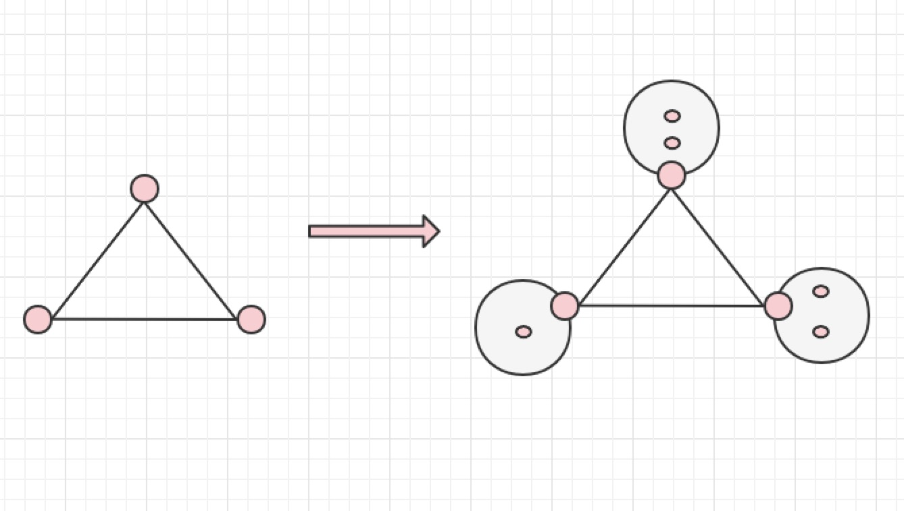

## cframe简要设计
本文档主要讨论关于cframe的设计细节，关于cframe的代码可以查看[cframe的项目主页](https://github.com/ICKelin/cframe)。整个系统的代码也非常少，只有两千多行代码，只需要半天时间即可阅读完。

关于cframe的使用，可以阅读[cframe使用](usage.md)了解更多。

本文整体思路采用自顶向下的方式，首先介绍cframe以及cframe的整体框架，然后针对整体框架当中的每个角色进行逐步细化，并从如何实现的，为什么这样实现进行阐述。

## 项目介绍
**cframe能够让任意不冲突的网络进行互联互通。**

如果您同时使用了阿里云和腾讯云，那么会有两个VPC，每个VPC有自己内部的网络，那么如何让其两端都能通过内网IP访问，cframe就可以解决这个问题。

如果您在阿里云和腾讯云上分别部署了k8s集群，k8s内部有自己的网络，那么在某些场景下您需要两个k8s集群能够相互访问，cframe也可以解决这个问题。

如果您使用了自建机房和公有云，那么如何让自建机房和公有云能够通过内网IP访问，cframe也可以解决这类问题。

下面展示的是使用cframe将六个不冲突的网络进行打通，只要我身处任何一个网络当中，都可以通过内网IP访问到其他网络的主机。

```
➜  ~ cfctl edge list
edge list:
      Name            Listener                  CIDR
-----------------------------------------------------------
1     edge-gcl-tc     x.x.x.x:58423       10.0.8.6
2     edge-sz-branch  x.x.x.x:48423       10.60.6.0/24
3     edge-sz-home    x.x.x.x:58424       192.168.31.0/24
4     edge-us-aws     x.x.x.x:58423       172.31.39.169
5     edge-aliyun-hk  x.x.x.x:58423       172.17.8.10
6     edge-aliyun-sz  x.x.x.x:58423       172.18.0.0/16
```

## 整体框架


正如上图所示，cframe包含三个角色以及一个开源组件组件（etcd）

- cfctl - 一个cli工具，给使用者进行系统管理的
- controller  - 全局控制器
- edge - 边缘节点
- etcd - 存储系统

首先是cfctl工具，用来管理`namespace`，`edge`以及路由，在最初的版本当中，并没有考虑设计这个工具，当时设计的是一个`apiserver`的服务，通过http接口的方式管理集群，甚至还希望能够在此之上做一个控制面板。但是后面版本当中并没有继续采用这种方案，主要原因是： apiserver的方式固然可以让使用者更加方便，但是毕竟不是我所擅长的领域，目前阶段不愿意过多的投入，倒不如集中力量把最核心的功能做好，当然如果有人愿意参与进来的话我也是非常欢迎的。

其次是controller，controller是为了方便给使用者一个入口的，试想一下，如果没有controller的配置，那么新增edge节点时，就需要在每个edge节点上加网络配置，一方面容易出错，另外一方面需要对网络比较熟悉，设计了controller之后，无论是添加edge还是删除edge，只需要controller统一下发配置变更，由edge程序自动执行变更操作。

接下来是edge节点，edge节点的功能只有一个路由转发。每个edge节点最初只设计包含一个VPC网络，也就是如果有三个edge节点，那么整个系统就只有三个网络，但是后来发现，像部署在公有云上的k8s集群，VPC有一个网络，service有一个网络，pod还有一个网络，那么也就是说一个edge下面挂了三个网络，因此除了edge节点自身的网络之外，还设计了全局路由功能，在controller上添加路由之后，这个edge的就会新增一个网络，其他edge的发往这个网络的数据就会被该edge包接收，详细设计在后续章节会有讨论。

最后是etcd，最初的版本也没有考虑使用存储系统，数据都存储在内存当中，但是在部署多节点时，就需要保持多节点数据的一致，同时，还要保证配置能够及时生效，最终索性用etcd，这样还能解偶，不用在controller内部写入配置，减轻controller的复杂性。

了解了整体框架之后，那么接下来会实现细节进行详细阐述。

## 租户隔离
租户隔离cframe采用的是namespace的概念，每个namespace下的edge，路由不会相互影响，从而实现隔离。正是因为设计了namespace，所以在cfctl当中，每个命令基本上都需要带`--ns`的参数指定namespace名称。

最初的设计是按用户进行隔离，但是详细考虑了下，需要做一个用户系统，显然这个不是我目前所希望进行的，试想一下在golang当中，相同的结构体是可以出现在不同的包中的，namespace与此类似。

当然现在的设计也有问题，不允许不同的用户有相同的namespace，但是针对开源项目而言我觉得这个是可以接受的，因为都是单租户，多业务，namespace代表的是业务线。

## etcd存储设计
在etcd当中主要存储以下三种信息：

- edge节点的信息
- 路由信息
- namespace信息

其目录设计如下:

```
/edges/$namespace/$edgename

/routes/$namespace/$routename

/namespaces/$namespace_name

```

除了对上述key进行增删查之外，还需要实时watch `/edges/*`和`/routes/*`的变化，当发生变更时，及时下发到所有运行中的edge节点当中，使配置生效。

## controller和edge的设计
controller和edge是最核心的部分，可能跟很多同学的理解不太一样，认为最核心的地方应该是最复杂，我是刚好相反，最核心的地方我希望保持最简单，只做最核心的一件事，controller和edge无疑保持了我这样的想法。

controller只做路由下发，edge只做路由，两者配合，前者给菜谱，后者做菜。

**controller**

controller的工作非常的存粹，负责与客户端保持长连接，并在etcd的`/edges/*`和`/routes/*`两个目录发生变更时，通过长连接通知edge节点。

**edge**

edge则相对要多一点设计，edge维护与controller的连接，以及三种路由关系，这三种路由分别是：

- VPC路由，目的是让本VPC当中其他云服务器的流量发往edge所在的实例。
- 系统静态路由，目的是让在本机流转的数据包能够被edge应用程序所劫持
- 程序内部维护的路由，目的是知道下一跳edge的公网IP和端口

VPC路由有过一个坎坷的经历，最初是设计了VPC路由，后面又移除，现在还在考虑是否需要加入。

VPC路由是可以由运维人员在公有云控制面板上配置的，这样子就不需要VPC路由，但是又会稍显麻烦，加入VPC路由的话，则需要新增公有云的accesstoken信息，这又是一个比较危险的操作，最终搁置。

**controller与edge交互**

controller与edge之间的交互方式是tcp长连接，在以下几个时机会触发配置更新：

- 刚建立连接时，controller会把当前所有edge节点以及路由信息返回给edge
- 当etcd当中存储的edge，路由信息变更时，会主动推响应的命令以及数据给edge节点
- 当edge节点被删除时，会给删除的edge节点发送exit指令。

除此之外edge会定时上报一些数据给controller，当然这部分数据目前还没用到，也没有存储，但是以后如果需要新增的话彼时controller将不会那么存粹。

## 路由设计
为了实现一个vpc当中存在多个网络的问题，设计了路由模块，允许自定义路由。

在路由模块出现之前，只有edge模块，edge模块关联一个cidr，这个通常是VPC的地址段，只有一个，但是后面为了应付容器，k8s组件构建的网络，因此设计了自定义路由模块，允许往该edge节点下挂多个子网。



在上图中，三个edge节点下分别有其他子网，这一功能是通过自定义路由模块来实现的。

## 目前的缺点
整个cframe目前也仅仅只是一个可用的版本，在数据安全，链路监控，安全性检查方面都没有做太多的考虑，当前cframe还有很多需要打磨的地方。